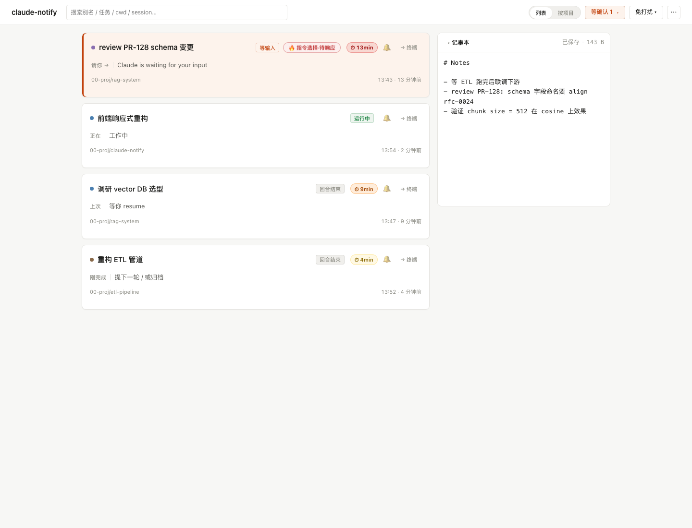

# claude-notify

> 给 Claude Code 用户的本地通知系统：监控所有会话的 hook 事件，关键节点（等输入 / 等授权 / 任务结束 / 长任务疑挂）推飞书 / 浏览器桌面通知 + 本地 dashboard 实时展示。多会话并行不漏看。

## 它解决什么问题

你同时开了 5 个 Claude Code 终端跑各种长任务，切到别的事情上后，**没人提醒你**：
- 任务跑完了等你下一步指令
- Claude 卡在「请求授权 rm -rf …」等你确认
- 子 agent 派出去 30 分钟没动静（疑似 hang）
- 多会话之间分不清谁是谁

claude-notify 把所有 Claude Code 进程的 hook 事件聚合起来：
- 飞书机器人**只在你需要手动介入时**推一下（默认收紧策略，3 次封顶）
- 本地 dashboard 一眼看清所有 session 状态
- 可选 LLM 摘要：把杂乱的 prompt/响应浓缩成一句话标题

## 截图



> 4 个 session 同时跑：等输入 + 🔥 指令选择徽 + ⏱ 13min 红色紧急度 / 运行中 / 回合结束 + 紧急度徽 / 项目分组路径 / 右侧记事本。卡片极简，只显示状态机里有意义的信息；开发者要 debug 推送决策走 `data/push_decisions.jsonl`（见末段）。

## 快速开始

### 0. 前置

- macOS（已测；Linux 原则上可，但 `hook-notify.py` 用了 `fcntl.flock` 和 `ps -p $PID -o tty=`，**Windows 不支持**）
- Python 3.11+（建议先建独立 venv 或 conda env）
- Claude Code CLI 已可用（终端 `which claude` 能找到）
- 飞书账号（用来建机器人）

### 1. 安装

```bash
git clone https://github.com/xtianowner/claude-notify.git
cd claude-notify
pip install -r backend/requirements.txt
```

### 2. 启动后端

```bash
# 必须在 repo 根目录执行：data/ 目录会以当前工作目录为基准生成
python -m backend.app
# 默认监听 127.0.0.1:8787
```

打开 http://127.0.0.1:8787 看 dashboard。空 dashboard 会显示一张「**首次接入检查**」卡片，列出三步：hook 已装 / webhook 已配 / 等首个事件。按它走即可。

要让它后台跑：

```bash
# 简单 nohup
nohup python -m backend.app > /tmp/claude-notify.log 2>&1 &

# 或写一个 LaunchAgent plist（macOS）/ systemd unit（Linux）—— 自行 google
```

### 3. 选推送渠道：飞书 / 浏览器桌面通知 / 两者都开

dashboard ⋯ → 配置 → 最顶部 **推送渠道** 两个 checkbox。两者独立可选：

| 模式 | 适用 | 需要做的事 |
|---|---|---|
| **只飞书** | 想在手机收通知 / 不想长期开浏览器 | 勾飞书 + 配 webhook（下面 §3a）；可去勾"浏览器" |
| **只浏览器** | 不想用飞书 / 隐私敏感 / 公司禁飞书 | 勾浏览器 + 授权（下面 §3b）；飞书 webhook 可留空 |
| **两者并存**（默认） | 手机 + 电脑双覆盖 | 两者都勾，按 §3a + §3b 都做一遍 |

> 关掉飞书后 `feishu.send_event` 不发起 HTTP，dashboard 仍接事件、浏览器仍弹通知。

#### 3a. 飞书 webhook（如启用飞书渠道）

1. 打开飞书 → 任意群 → 群设置 → **群机器人 → 添加机器人 → 自定义机器人**
2. 起名（如 "claude-notify"）→ 复制下方 **Webhook 地址**（形如 `https://open.feishu.cn/open-apis/bot/v2/hook/xxxxxxxx`）
3. **安全设置**：默认我们的消息标题里含 "claude" 关键字，所以最简单是设「自定义关键词 = `claude`」即可。如果你要更强的安全策略，可改用 **签名校验**，把得到的 secret 一起填进 dashboard 的 `feishu_secret`
4. 在 dashboard 右下角 ⚙ → 配置面板 → **飞书 Webhook URL** 粘贴 → 保存。点顶部 ⋯ → **测试推送** 验证

> 飞书官方文档（自定义机器人）：https://open.feishu.cn/document/client-docs/bot-v3/add-custom-bot

#### 3b. 浏览器桌面通知（如启用浏览器渠道）

dashboard 打开后顶部会弹一条"启用桌面通知"条带 → 点 [启用] → 浏览器弹权限请求 → 允许。

**但只授权浏览器还不够 —— macOS / Windows 系统层还有 2 道关卡常被忽略**：

**macOS 用户必做的 3 层检查**（最容易踩坑）：

1. **浏览器权限**：上面条带点过 [启用] 后，console 跑 `Notification.permission` 应返回 `'granted'`。  
   _如果是 `'denied'`_：地址栏左侧 🔒 → 网站设置 → 通知 → 改为"允许"。

2. **macOS 系统通知**（最常被遗漏）：苹果菜单 → 系统设置 → 通知 → 右侧找你的浏览器（Google Chrome / Safari / Edge / Arc）：
   - **允许通知**：必须打开
   - **通知样式**：选 "横幅" 或 "提醒"（"无" = 通知被静默吞掉）
   - 锁屏 / 通知中心 / Dock 角标：按需打开

3. **专注 / 勿扰模式**：屏幕右上角 → 控制中心 → 看「专注」一栏。任何模式亮着（勿扰 / 工作 / 睡眠）= 通知被静默。**这是 90% "授权了但没弹"的真凶**。

**Windows 用户**：设置 → 系统 → 通知 → 找浏览器 → 打开通知 + 在通知中心显示 + 关「专注助手」。

**Linux 用户**：libnotify / notify-osd 通常默认就工作，无系统层拦截。

**验证链路** —— 在任意终端跑：

```bash
curl -X POST http://127.0.0.1:8787/api/test-notify
```

应立即看到屏幕右上角 / 通知中心弹一条"测试推送 · claude-notify"。**没弹的话直接 console 跑 `new Notification("test")` 绕过我代码直测**：

- 这条都没弹 → macOS 系统层拦着，按上面 1-2-3 排查
- 这条弹了但 curl 不弹 → tab 没切到后台 / Web 渠道 toggle 没勾 / 后端没重启

### 4. 注册 Hook（让 Claude Code 把事件投给本地后端）

```bash
python3 scripts/install-hooks.py            # 安装（推荐）
python3 scripts/install-hooks.py --dry-run  # 只打印 settings.json 改动预览
python3 scripts/install-hooks.py --uninstall  # 卸载
```

**关于已有 hook 的冲突**：脚本只识别**自家** hook（按命令含 `hook-notify.py` 关键字判定）。你已有的其它 hook **会原样保留**，不会被删/改。每次写入前自动备份 `~/.claude/settings.json` 到 `~/.claude/settings.json.bak-<YYYYMMDD-HHMMSS>`。

注册的 hook 共 6 条：`Notification` / `Stop` / `SubagentStop` / `SessionStart` / `SessionEnd`（事件型）+ `PreToolUse`（心跳型，加 `--heartbeat` 不推送）。

装完后任意 Claude Code 终端发一句话，dashboard 即应出现该 session 卡片。

### 5. 配置 LLM 智能摘要（可选）

dashboard ⚙ → 配置面板里有 LLM 段。三种 provider 选一：

| Provider | 适用 | 凭据来源 | 速度 | 关键字段 |
|---|---|---|---|---|
| **local_cli**（默认） | Claude Code 用户 | Claude OAuth（Max 订阅免 key） | 7-15s（官方 claude）/ 4-5s（reclaude） | `binary`（空=自动探测；可填 reclaude 绝对路径） |
| **anthropic** | 有 sk-ant-... key | `ANTHROPIC_API_KEY` 环境变量或面板填入 | 1-2s | `api_key` / `model` / `base_url`（默认官方 endpoint） |
| **openai** | DeepSeek / Qwen / Ollama / 自托管 vLLM / 第三方代理 | 任意 OpenAI 兼容 endpoint | 4-7s | `api_key` / `model` / `base_url`（含 `/v1` 后缀） |

> **关掉 LLM 也能用**：默认走启发式摘要（关键词匹配），机械但够用，飞书消息照样有标题。

> **local_cli binary 自动探测顺序**：`reclaude` → `claude`（PATH 内）。若你用 nvm/asdf 装的 Claude，PATH 在 systemd / launchd 子进程里可能缺，**建议直接把 `binary` 填绝对路径**。

完整 LLM 字段说明 → [docs/configuration.md](docs/configuration.md#7-llm-摘要-llm)

## Dashboard 操作概览

每张 session 卡片支持：

| 操作 | 入口 | 用途 |
|---|---|---|
| ✎ 改别名 | 卡片标题旁铅笔图标 | 给 session 起人话名（"调 ETL 管道"），飞书 + dashboard 一致显示 |
| 🔔/🔕 静音单个 session | 卡片右上角 | 5min / 30min / 60min / 永久 / 仅 Stop·30min；真权限请求和 hang 仍穿透 |
| → 终端 focus | session 详情抽屉 | 一键唤起对应终端（基于 tty 记录） |
| ⏱ 紧急度徽 | 自动出现 | idle/waiting/suspect 状态卡片按等待时长显示浅黄/橙/红 |
| 🔥 指令选择·待响应 | 自动出现 | Claude 列菜单等你选择（"❯ 1. xxx"），bypass dup 立即推送 |
| 📝 记事本 | 右侧面板 | 800ms 自动存盘 + 多窗口同步，记 TODO / 调试线索 |
| 视图切换 | topbar 列表/按项目 | 5+ 项目同时跑用「按项目」分组 |
| 全局免打扰 | ⚙ → 免打扰时段 | 跨午夜支持 / 仅工作日 / 穿透白名单 |

完整操作语义（状态机 / 推送规则 / 别名 / 记事本） → [docs/user-guide.md](docs/user-guide.md)

> 开发者 debug 推送决策（"为什么这条推了 / 没推"）：后端仍在 `data/push_decisions.jsonl` 写决策日志，可 `curl http://127.0.0.1:8787/api/sessions/<sid>/decisions` 读，或直接 `tail -f` 文件。dashboard 之前的 trace UI 已下线（对最终用户是噪音）。

## 推送策略

每种事件可选三种行为：`immediate`（立即推） / `silence:N`（N 秒静默后推，期间相同 sid 事件合并发出）/ `off`（不推）。

| 事件 | 默认 | 含义 |
|---|---|---|
| `Notification` | immediate | 等输入 / 等授权 → 必推 |
| `TimeoutSuspect` | immediate | 长任务疑似 hang → 必推 |
| `Stop` | silence:12 | 主 agent 完成一回合（= 等下一步） → 12s 静默后推 |
| `SubagentStop` | off | 子 agent 完成 ≠ 主流程结束，不打扰 |
| `SessionDead/End/Heartbeat` | off | 不推 |

dashboard ⚙ → 配置可手动调整。除上述 5 个事件开关外，还有 30+ 字段（精细过滤 / liveness 阈值 / idle reminder / quiet hours / 归档 / LLM…） → [docs/configuration.md](docs/configuration.md)

## 故障排查

### 没收到推送？

- 用**飞书**渠道没收到 → 看下面"飞书推送排查"
- 用**浏览器**渠道没收到 → 看更下面"浏览器桌面通知不弹"（90% 是 macOS 系统通知 / 勿扰模式拦着，不是代码 bug）

### 飞书推送排查

1. **Dashboard 顶部 ⋯ → 测试推送** 点一下。
   - 飞书收到 → webhook 没问题，问题在事件流向（往下看 2）
   - 飞书没收到 → webhook URL 错 / 关键字白名单未设 / 签名校验失败。看 `data/config.json` 的 `feishu_webhook`，确认与飞书后台一致；关键字最简方案是设 `claude`。
2. **dashboard 上能看到 session 卡片吗？**
   - 看不到 → hook 没装上。重跑 `python3 scripts/install-hooks.py`，并 `cat ~/.claude/settings.json | grep hook-notify` 确认。
   - 看得到 → 事件流到 backend 了。看是不是被过滤吞了（卡片底部 trace 行点开 → reason 列）。常见 reason：`silence_then_merge_skip` / `policy_off` / `quiet_hours_in_window` / `session_muted` / `stop_sensitivity_strict`。
3. **后端日志**：`tail -f /tmp/claude-notify.log`（nohup 启动）或前台终端输出。

### 浏览器桌面通知不弹？

按这个顺序查（每步都做一遍）：

1. console 跑 `Notification.permission`，应返回 `'granted'`。`'denied'` → 地址栏 🔒 → 网站设置 → 通知 → 允许。
2. console 跑 `new Notification("test")` 直测浏览器 API。
   - **这条都没弹** → 100% 是 macOS / Windows 系统层拦着，按下面 3-5 排查
   - **这条弹了但 curl test-notify 不弹** → 配置 → 推送渠道 → 看"浏览器桌面通知"是否勾上 + 后端是否重启 + 浏览器硬刷新 cmd+shift+R
3. **macOS**：苹果菜单 → 系统设置 → 通知 → 找浏览器（Chrome / Safari / Edge / Arc）→ **允许通知**打开 + **通知样式**选"横幅"或"提醒"。
4. **macOS 专注 / 勿扰模式**：屏幕右上角控制中心 → 「专注」一栏。任何模式亮着 = 通知被吞。这是最常见的真凶。
5. **Windows**：设置 → 系统 → 通知 → 浏览器 → 打开通知 + 关「专注助手」。

### Dashboard 一直显示 "运行中" 但其实那个终端早关了

正常等 1-2 分钟内 watcher 应该会把它标 `dead`（pid 不在 + transcript 文件没了）。如果 30 分钟还没翻 → 看 `data/events.jsonl` 末尾是否有该 sid 的 `SessionDead` 事件。也可手动改 `data/config.json` 的 `dead_threshold_minutes` 降低阈值（默认 30min）。

### 端口 8787 被占用

```bash
PORT=9000 python -m backend.app  # 自定义端口
```

记得 hook 那边对应 `CLAUDE_NOTIFY_URL=http://127.0.0.1:9000`（hook-notify.py 支持此环境变量）。

### 看历史事件 / debug

- 所有事件流：`data/events.jsonl`（flock 串写，可放心 `tail -f`）
- 归档：`data/archive/*.jsonl.gz`（events 超过 50MB 自动滚动）
- 推送决策 50 条历史：dashboard 卡片底部 trace 行点开

## 卸载

```bash
python3 scripts/install-hooks.py --uninstall  # 移除 hook
# settings.json 自动备份过，找 ~/.claude/settings.json.bak-* 可回滚
rm -rf <claude-notify-repo>                    # 删 repo（含 data/）
```

无残留：所有数据集中在 `data/`，无系统级配置 / 全局 daemon / 第三方账户依赖。

## 架构

```
   Claude Code (多 session 并行)
        │  hooks: Notification / Stop / SubagentStop / PreToolUse(心跳) / SessionStart
        ▼
   scripts/hook-notify.py  ──flock──>  data/events.jsonl  (兜底，不挂)
        │  (异步 POST, fire-and-forget)
        ▼
   backend (FastAPI :8787)
     ├── notify_policy（silence-then 合并模式 + 优先级过滤）
     │   └── feishu webhook 推送
     ├── liveness_watcher（PID + transcript mtime 双信号判活/疑挂/dead）
     ├── llm_enrich（异步 topic + event 摘要，写 enrichments.jsonl 缓存）
     └── WebSocket → frontend（事件实时推 + LLM 摘要 ready 后增量推）
        │
        ▼
   frontend (vanilla HTML/JS/CSS, 零构建)
     单页 dashboard：session 卡片 / 抽屉式事件流 / 别名编辑 / 配置 / 记事本
```

- 模块清单 → [docs/modules.md](docs/modules.md)
- 配置参考 → [docs/configuration.md](docs/configuration.md)
- 用户手册 → [docs/user-guide.md](docs/user-guide.md)
- 设计教训 → [LESSONS.md](LESSONS.md)

## 反馈循环防护

启用「local_cli」LLM provider 时，backend 会 spawn `claude/reclaude` 子进程跑摘要。这些子进程**也是 Claude Code**，会触发 `~/.claude/settings.json` 里的 hook → 写 events → backend 又调 LLM → ♾️。

我们通过环境变量 `CLAUDE_NOTIFY_LLM_CHILD=1` 标记自家子进程，hook 顶部检测此标识立即退出。详细教训见 [LESSONS.md L02](LESSONS.md)。

## 数据 / 隐私

- `data/config.json`：含飞书 webhook + 可选 API key，**不进版本控制**（.gitignore 已配）
- `data/events.jsonl`：所有 hook 事件，flock 串写，重启不丢
- `data/enrichments.jsonl`：LLM 摘要缓存（按 transcript path + mtime 复用）
- `data/aliases.json` / `data/notes.json` / `data/decisions.jsonl`：你的 alias / 记事本 / 推送决策历史
- 全部数据**只在本机**，不上报，不联网（除你自己配的飞书 webhook 和可选 LLM endpoint）
- 凭据**不写入任何 .md / commit / 日志 / 文件名**

## 远程 / 多机器使用

默认监听 `127.0.0.1`（只本机可访问）。如果你想从 LAN 内别的机器看 dashboard：

```bash
HOST=0.0.0.0 python -m backend.app
```

**但要意识到 backend 没有 auth**，开 `0.0.0.0` 等于把 webhook URL 暴露给 LAN 内所有人（任何能访问 `:8787` 的设备都能拿到 config 接口里 mask 后的 webhook 前后位 + 删改你的 alias）。生产用建议套 reverse proxy + basic auth，或绑 tailscale 内网。

## 开发

```bash
# 跑测试套件（30+ 个测试脚本，按时间命名）
python scripts/0511-1310-test-r12-ghost-session.py    # R12 liveness watcher
python scripts/0511-1130-test-r11-hotfix.py           # R11 hotfix
python scripts/0511-1047-test-round11-backend.py      # R11 menu detection
# ... 见 scripts/ 目录
```

模块化原则、设计取舍详见 [docs/modules.md](docs/modules.md) 和 [LESSONS.md](LESSONS.md)。

## License

MIT — 见 [LICENSE](LICENSE)。

## 鸣谢

- [Anthropic Claude Code](https://docs.claude.com/en/docs/claude-code) — hook 体系是这个项目存在的基础
