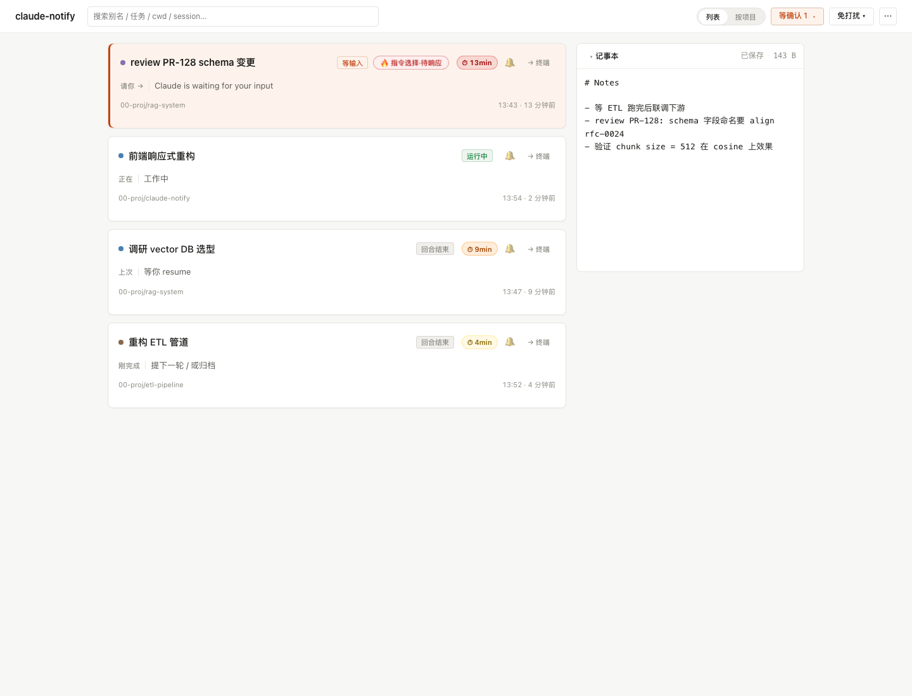

# claude-notify

> 给 Claude Code / Claude Desktop 用户的本地通知系统：监控所有会话的事件，关键节点（等输入 / 等授权 / 任务结束 / 长任务疑挂）推飞书 / 浏览器桌面通知 + 本地 dashboard 实时展示。多会话并行不漏看。
>
> **覆盖面**：
> - **Claude Code CLI**（任意 OS）→ 走 `~/.claude/settings.json` 的 hook 体系
> - **Claude Desktop**（macOS Electron app，R29-R45）→ 走 macOS Accessibility API 桥接 + 可选 MCP server 辅助通道
>
> Dashboard 列表按板块分三段不混放：终端 (CLI) / Claude Desktop · Code / Claude Desktop · Cowork（Chat 板块不采集）。同一会话两个观测视角自动合并为一张卡。设计细节见 [docs/desktop-bridge/design.md](docs/desktop-bridge/design.md)，版本演进见 [CHANGELOG.md](CHANGELOG.md)。

## 它解决什么问题

你同时开了 5 个 Claude Code 终端跑各种长任务，切到别的事情上后，**没人提醒你**：
- 任务跑完了等你下一步指令
- Claude 卡在「请求授权 rm -rf …」等你确认
- 子 agent 派出去 30 分钟没动静（疑似 hang）
- 多会话之间分不清谁是谁

claude-notify 把所有 Claude Code 进程的 hook 事件聚合起来：
- 飞书机器人**只在你需要手动介入时**推一下（默认收紧策略，3 次封顶）
- 本地 dashboard 一眼看清所有 session 状态
- 可选 LLM 摘要：把杂乱的 prompt/响应浓缩成一句话标题

## 截图



> 4 个 session 同时跑：等输入 + 🔥 指令选择徽 + ⏱ 13min 红色紧急度 / 运行中 / 回合结束 + 紧急度徽 / 项目分组路径 / 右侧记事本。卡片极简，只显示状态机里有意义的信息；开发者要 debug 推送决策走 `data/push_decisions.jsonl`（见末段）。

## 快速开始

### 0. 前置

- macOS（已测；Linux 原则上可，但 `hook-notify.py` 用了 `fcntl.flock` 和 `ps -p $PID -o tty=`，**Windows 不支持**）
- Python 3.11+（建议先建独立 venv 或 conda env）
- Claude Code CLI 已可用（终端 `which claude` 能找到）
- 飞书账号（用来建机器人）

### 1. 安装

```bash
git clone https://github.com/xtianowner/claude-notify.git
cd claude-notify
pip install -r backend/requirements.txt
```

### 2. 启动后端

```bash
# 必须在 repo 根目录执行：data/ 目录会以当前工作目录为基准生成
python -m backend.app
# 默认监听 127.0.0.1:8787
```

打开 http://127.0.0.1:8787 看 dashboard。空 dashboard 会显示一张「**首次接入检查**」卡片，列出三步：hook 已装 / webhook 已配 / 等首个事件。按它走即可。

要让它后台跑：

```bash
# 简单 nohup
nohup python -m backend.app > /tmp/claude-notify.log 2>&1 &

# 或写一个 LaunchAgent plist（macOS）/ systemd unit（Linux）—— 自行 google
```

### 3. 选推送渠道：飞书 / 浏览器桌面通知 / 两者都开

dashboard ⋯ → 配置 → 最顶部 **推送渠道** 两个 checkbox。两者独立可选：

| 模式 | 适用 | 需要做的事 |
|---|---|---|
| **只飞书** | 想在手机收通知 / 不想长期开浏览器 | 勾飞书 + 配 webhook（下面 §3a）；可去勾"浏览器" |
| **只浏览器** | 不想用飞书 / 隐私敏感 / 公司禁飞书 | 勾浏览器 + 授权（下面 §3b）；飞书 webhook 可留空 |
| **两者并存**（默认） | 手机 + 电脑双覆盖 | 两者都勾，按 §3a + §3b 都做一遍 |

> 关掉飞书后 `feishu.send_event` 不发起 HTTP，dashboard 仍接事件、浏览器仍弹通知。

#### 3a. 飞书 webhook（如启用飞书渠道）

1. 打开飞书 → 任意群 → 群设置 → **群机器人 → 添加机器人 → 自定义机器人**
2. 起名（如 "claude-notify"）→ 复制下方 **Webhook 地址**（形如 `https://open.feishu.cn/open-apis/bot/v2/hook/xxxxxxxx`）
3. **安全设置**：默认我们的消息标题里含 "claude" 关键字，所以最简单是设「自定义关键词 = `claude`」即可。如果你要更强的安全策略，可改用 **签名校验**，把得到的 secret 一起填进 dashboard 的 `feishu_secret`
4. 在 dashboard 右下角 ⚙ → 配置面板 → **飞书 Webhook URL** 粘贴 → 保存。点顶部 ⋯ → **测试推送** 验证

> 飞书官方文档（自定义机器人）：https://open.feishu.cn/document/client-docs/bot-v3/add-custom-bot

#### 3b. 浏览器桌面通知（如启用浏览器渠道）

dashboard 打开后顶部会弹一条"启用桌面通知"条带 → 点 [启用] → 浏览器弹权限请求 → 允许。

**但只授权浏览器还不够 —— macOS / Windows 系统层还有 2 道关卡常被忽略**：

**macOS 用户必做的 3 层检查**（最容易踩坑）：

1. **浏览器权限**：上面条带点过 [启用] 后，console 跑 `Notification.permission` 应返回 `'granted'`。  
   _如果是 `'denied'`_：地址栏左侧 🔒 → 网站设置 → 通知 → 改为"允许"。

2. **macOS 系统通知**（最常被遗漏）：苹果菜单 → 系统设置 → 通知 → 右侧找你的浏览器（Google Chrome / Safari / Edge / Arc）：
   - **允许通知**：必须打开
   - **通知样式**：选 "横幅" 或 "提醒"（"无" = 通知被静默吞掉）
   - 锁屏 / 通知中心 / Dock 角标：按需打开

3. **专注 / 勿扰模式**：屏幕右上角 → 控制中心 → 看「专注」一栏。任何模式亮着（勿扰 / 工作 / 睡眠）= 通知被静默。**这是 90% "授权了但没弹"的真凶**。

**Windows 用户**：设置 → 系统 → 通知 → 找浏览器 → 打开通知 + 在通知中心显示 + 关「专注助手」。

**Linux 用户**：libnotify / notify-osd 通常默认就工作，无系统层拦截。

**验证链路** —— 在任意终端跑：

```bash
curl -X POST http://127.0.0.1:8787/api/test-notify
```

应立即看到屏幕右上角 / 通知中心弹一条"测试推送 · claude-notify"。**没弹的话直接 console 跑 `new Notification("test")` 绕过我代码直测**：

- 这条都没弹 → macOS 系统层拦着，按上面 1-2-3 排查
- 这条弹了但 curl 不弹 → tab 没切到后台 / Web 渠道 toggle 没勾 / 后端没重启

### 3c. （可选）启用 Claude Desktop 桥接（macOS）

如果你也用 **Claude Desktop**（`/Applications/Claude.app`，对应 claude.ai SPA），claude-notify 可以监控桌面端会话窗口的「生成中 / 等输入 / 等确认」状态。原理是 macOS Accessibility API 轮询 Claude.app 的窗口树，不依赖 hook，不需要改 Claude Desktop 启动参数。

**三步开启**：

1. 装额外依赖（pyobjc 的 AX 模块）：
   ```bash
   pip install -r backend/requirements-desktop.txt
   ```
2. **授权辅助功能**：苹果菜单 → 系统设置 → **隐私与安全** → **辅助功能** → 把当前运行 backend 的 python 解释器拖进去（路径用 `which python3` 查），打钩。
3. 编辑 `data/config.json`，把 `desktop_bridge.enabled` 改为 `true`，重启 backend：
   ```bash
   python -c "import json; from pathlib import Path; p=Path('data/config.json'); c=json.loads(p.read_text() or '{}'); c.setdefault('desktop_bridge',{})['enabled']=True; p.write_text(json.dumps(c, indent=2, ensure_ascii=False))"
   ```
   > Dashboard config 面板暂未暴露此开关（[TODO](https://github.com/xtianowner/claude-notify/issues)），目前需直接编辑 config.json。

验证：
```bash
python3 scripts/desktop_ax_dump.py | head -30   # 应该能看到 [window 0] 节点输出
```

如果输出 `[warn] 当前 python 没有辅助功能权限` → 第 2 步没生效，常见原因：把 `/usr/bin/python3` 加了但 backend 跑的是 conda env / venv 里的另一个 python。**实际跑 backend 的解释器**才是需要授权的那个。

桥接事件 `source = desktop_app`，与 `claude_code` 共用 dashboard / 推送策略 / 静音 / 配置面板。卡片项目名固定 `Claude Desktop`，标题取自 Claude 窗口标题。

### 3d. （可选）让 Claude Desktop 自报家门 — MCP 辅助通道

R30 的 AX 桥接能感知"生成中 / 等输入"等 UI 状态，但拿不到对话语义。`scripts/mcp_notify_server.py` 提供一个 MCP server，暴露 `notify_progress(title, summary, level)` 工具：Claude 在 system prompt 引导下完成里程碑或卡决策点时**主动调用**，补足 AX 的语义盲区。

**安装步骤**：

1. `pip install mcp`
2. 编辑 `~/Library/Application Support/Claude/claude_desktop_config.json`，在 `mcpServers` 段加：
   ```json
   {
     "mcpServers": {
       "claude-notify": {
         "command": "/绝对路径/python3",
         "args": ["/绝对路径/claude-notify/scripts/mcp_notify_server.py"]
       }
     }
   }
   ```
   `command` 用 `which python3` 查；`args` 路径用 `realpath scripts/mcp_notify_server.py` 查。
3. 重启 Claude Desktop。
4. 在 Claude Desktop 对话开头加一段引导：
   > 每次完成一个里程碑、卡在用户决策点、或刚启动一段长任务时，调用 `notify_progress` 工具向 dashboard 汇报。title 一句话主题，summary 一句话进度，level 用 `info`/`milestone`/`blocked`。

**事件映射**：`level=blocked` → Notification 必推；`milestone`/`info` → Stop（12s 静默合并，按默认推送策略）。session_id 以 `mcp-<conversation_id>` 编排，多轮汇报会聚合到同一张卡片。

MCP 与 AX 桥接互补不互斥：AX 抓 UI 状态，MCP 拿语义摘要，dashboard 用 source=desktop_app 统一展示。

### 4. 注册 Hook（让 Claude Code 把事件投给本地后端）

```bash
python3 scripts/install-hooks.py            # 安装（推荐）
python3 scripts/install-hooks.py --dry-run  # 只打印 settings.json 改动预览
python3 scripts/install-hooks.py --uninstall  # 卸载
```

**关于已有 hook 的冲突**：脚本只识别**自家** hook（按命令含 `hook-notify.py` 关键字判定）。你已有的其它 hook **会原样保留**，不会被删/改。每次写入前自动备份 `~/.claude/settings.json` 到 `~/.claude/settings.json.bak-<YYYYMMDD-HHMMSS>`。

注册的 hook 共 7 条：`Notification` / `Stop` / `SubagentStop` / `SessionStart` / `SessionEnd` / `UserPromptSubmit`（事件型）+ `PreToolUse`（心跳型，加 `--heartbeat` 不推送）。其中 `UserPromptSubmit` 是 dashboard 状态从"等输入"翻回"工作中"的唯一信号源 —— 缺它会导致回话后 dashboard 状态不更新（L43）。

装完后任意 Claude Code 终端发一句话，dashboard 即应出现该 session 卡片。

### 5. 配置 LLM 智能摘要（可选）

dashboard ⚙ → 配置面板里有 LLM 段。三种 provider 选一：

| Provider | 适用 | 凭据来源 | 速度 | 关键字段 |
|---|---|---|---|---|
| **local_cli**（默认） | Claude Code 用户 | Claude OAuth（Max 订阅免 key） | 7-15s（官方 claude）/ 4-5s（reclaude） | `binary`（空=自动探测；可填 reclaude 绝对路径） |
| **anthropic** | 有 sk-ant-... key | `ANTHROPIC_API_KEY` 环境变量或面板填入 | 1-2s | `api_key` / `model` / `base_url`（默认官方 endpoint） |
| **openai** | DeepSeek / Qwen / Ollama / 自托管 vLLM / 第三方代理 | 任意 OpenAI 兼容 endpoint | 4-7s | `api_key` / `model` / `base_url`（含 `/v1` 后缀） |

> **关掉 LLM 也能用**：默认走启发式摘要（关键词匹配），机械但够用，飞书消息照样有标题。

> **local_cli binary 自动探测顺序**：`reclaude` → `claude`（PATH 内）。若你用 nvm/asdf 装的 Claude，PATH 在 systemd / launchd 子进程里可能缺，**建议直接把 `binary` 填绝对路径**。

完整 LLM 字段说明 → [docs/configuration.md](docs/configuration.md#7-llm-摘要-llm)

## 更新到最新版本

老版本 → 最新一键升级：

```bash
cd <claude-notify-repo>
python3 scripts/update.py            # 标准升级（不动 backend）
python3 scripts/update.py --restart  # 升级 + 自动重启 backend
python3 scripts/update.py --dry-run  # 只打印命令不执行（先看一眼）
```

脚本做的事：
1. 检查 `git status` — 有 modified/staged 改动会拒绝（避免覆盖你的本地修改；untracked 文件 OK，pull 不会动它们）
2. `git pull --ff-only origin main`
3. `pip install -r backend/requirements.txt`
4. **macOS 自动加装** `pip install -r backend/requirements-desktop.txt`（Linux 跳过）
5. 提示你重启 backend（或 `--restart` 自动重启）
6. 打印从旧 HEAD 到新 HEAD 的 commit 列表，一眼看清改了什么

**数据 / 配置 / hook 都不动**：
- `data/` 在 `.gitignore` 内，pull 不会动你的 webhook / events 历史 / 别名
- `backend/config.py` 用 `_merge(DEFAULTS, 用户 config.json)` 自动 merge 新字段，老用户配置无需手工迁移（任何字段你显式改过的都保留，没改过的跟 DEFAULTS）
- `~/.claude/settings.json` 里的 hook 注册不动（如有 hook 协议变更会在 CHANGELOG 标注，需手动跑 `python3 scripts/install-hooks.py` 重装）

如果脚本有任何环节出错或你想全手动：

```bash
git stash                            # 如有本地改动
git pull --ff-only origin main
pip install -r backend/requirements.txt
[ "$(uname)" = "Darwin" ] && pip install -r backend/requirements-desktop.txt
pkill -f 'uvicorn backend.app'
nohup python3 -m uvicorn backend.app:app --host 127.0.0.1 --port 8787 > /tmp/claude-notify.log 2>&1 &
git stash pop                        # 恢复本地改动
```

完整版本演进记录见 [CHANGELOG.md](CHANGELOG.md)。回滚到 R28 之前（CLI-only 版本）：

```bash
git reset --hard pre-desktop-bridge-R29
```

## Dashboard 操作概览

每张 session 卡片支持：

| 操作 | 入口 | 用途 |
|---|---|---|
| ✎ 改别名 | 卡片标题旁铅笔图标 | 给 session 起人话名（"调 ETL 管道"），飞书 + dashboard 一致显示 |
| 🔔/🔕 静音单个 session | 卡片右上角 | 5min / 30min / 60min / 永久 / 仅 Stop·30min；真权限请求和 hang 仍穿透 |
| → 终端 focus | session 详情抽屉 | 一键唤起对应终端（基于 tty 记录） |
| ⏱ 紧急度徽 | 自动出现 | idle/waiting/suspect 状态卡片按等待时长显示浅黄/橙/红 |
| 🔥 指令选择·待响应 | 自动出现 | Claude 列菜单等你选择（"❯ 1. xxx"），bypass dup 立即推送 |
| 📝 记事本 | 右侧面板 | 800ms 自动存盘 + 多窗口同步，记 TODO / 调试线索 |
| 视图切换 | topbar 列表/按项目 | 5+ 项目同时跑用「按项目」分组 |
| 全局免打扰 | ⚙ → 免打扰时段 | 跨午夜支持 / 仅工作日 / 穿透白名单 |
| 飞书 ↗ 链接 tab 复用 | ⚙ → 飞书 ↗ 链接 tab 复用 | 已开 dashboard 时点链接自动跳前台（默认）/ 弹两按钮让用户选（备选）—— L47 / R22 |

完整操作语义（状态机 / 推送规则 / 别名 / 记事本） → [docs/user-guide.md](docs/user-guide.md)

> 开发者 debug 推送决策（"为什么这条推了 / 没推"）：后端仍在 `data/push_decisions.jsonl` 写决策日志，可 `curl http://127.0.0.1:8787/api/sessions/<sid>/decisions` 读，或直接 `tail -f` 文件。dashboard 之前的 trace UI 已下线（对最终用户是噪音）。

## 推送策略

每种事件可选三种行为：`immediate`（立即推） / `silence:N`（N 秒静默后推，期间相同 sid 事件合并发出）/ `off`（不推）。

| 事件 | 默认 | 含义 |
|---|---|---|
| `Notification` | immediate | 等输入 / 等授权 → 必推 |
| `TimeoutSuspect` | immediate | 长任务疑似 hang → 必推 |
| `Stop` | silence:12 | 主 agent 完成一回合（= 等下一步） → 12s 静默后推 |
| `SubagentStop` | off | 子 agent 完成 ≠ 主流程结束，不打扰 |
| `SessionDead/End/Heartbeat` | off | 不推 |

dashboard ⚙ → 配置可手动调整。除上述 5 个事件开关外，还有 30+ 字段（精细过滤 / liveness 阈值 / idle reminder / quiet hours / 归档 / LLM…） → [docs/configuration.md](docs/configuration.md)

## 故障排查

### 没收到推送？

- 用**飞书**渠道没收到 → 看下面"飞书推送排查"
- 用**浏览器**渠道没收到 → 看更下面"浏览器桌面通知不弹"（90% 是 macOS 系统通知 / 勿扰模式拦着，不是代码 bug）

### 飞书推送排查

1. **Dashboard 顶部 ⋯ → 测试推送** 点一下。
   - 飞书收到 → webhook 没问题，问题在事件流向（往下看 2）
   - 飞书没收到 → webhook URL 错 / 关键字白名单未设 / 签名校验失败。看 `data/config.json` 的 `feishu_webhook`，确认与飞书后台一致；关键字最简方案是设 `claude`。
2. **dashboard 上能看到 session 卡片吗？**
   - 看不到 → hook 没装上。重跑 `python3 scripts/install-hooks.py`，并 `cat ~/.claude/settings.json | grep hook-notify` 确认。
   - 看得到 → 事件流到 backend 了。看是不是被过滤吞了 → `tail -20 data/push_decisions.jsonl` 或 `curl http://127.0.0.1:8787/api/sessions/<sid>/decisions`（dashboard trace UI 已下线 L38）。常见 reason：`silence_then_merge_skip` / `policy_off` / `quiet_hours_in_window` / `session_muted` / `stop_sensitivity_strict`。
3. **后端日志**：`tail -f /tmp/claude-notify.log`（nohup 启动）或前台终端输出。

### 浏览器桌面通知不弹？

**先开 console 看日志定位丢在哪一环（L42 / R17）**：

打开 dashboard 的 Devtools console，触发一次"测试推送"（设置 → 测试推送）后看：

- **没看到 `[notify] push_event recv`** → 前端没收到，再去看 backend 终端日志的 `push_event broadcast clients=N`：
  - `clients=0` → 你这个 tab 没接上 WS（页面没真正连上 / 刚刷新 / Chrome Memory Saver 把后台 tab 休眠了）→ 切到前台 dashboard 让它重连，重连会自动补 60s 内的事件
  - `clients>0 但你这边收不到` → 罕见，重启后端
- **看到 `[notify] push_event recv` 但没 OS 横幅** → 看后面紧跟着的 skip 行：
  - `skip: channel off` → 设置里"浏览器桌面通知"没勾
  - `skip: permission = default/denied` → 没授权，看下面第 1 步
  - `skip: dup ...` → 正常（重连补发，前端去重）
  - **没 skip 行 → 已经调了 `new Notification()` 但 OS 没显示** → 100% 系统层拦着，按下面第 3-5 步

按这个顺序查（每步都做一遍）：

1. console 跑 `Notification.permission`，应返回 `'granted'`。`'denied'` → 地址栏 🔒 → 网站设置 → 通知 → 允许。
2. console 跑 `new Notification("test")` 直测浏览器 API。
   - **这条都没弹** → 100% 是 macOS / Windows 系统层拦着，按下面 3-5 排查
   - **这条弹了但 curl test-notify 不弹** → 看上面 console 日志诊断
3. **macOS**：苹果菜单 → 系统设置 → 通知 → 找浏览器（Chrome / Safari / Edge / Arc）→ **允许通知**打开 + **通知样式**选"横幅"或"提醒"。
4. **macOS 专注 / 勿扰模式**：屏幕右上角控制中心 → 「专注」一栏。任何模式亮着 = 通知被吞。这是最常见的真凶。
5. **Windows**：设置 → 系统 → 通知 → 浏览器 → 打开通知 + 关「专注助手」。

**已知限制**：浏览器通道天然不如飞书可靠（OS 勿扰 / Chrome 休眠后台 tab / 系统通知中心可被关）。重连补发只保最近 60s 内的事件，超过窗口的丢了由飞书兜底 —— 这是"前台用 dashboard 时少切到飞书 App"的便利通道，不是飞书替代品。

### Dashboard 一直显示 "运行中" 但其实那个终端早关了

正常等 1-2 分钟内 watcher 应该会把它标 `dead`（pid 不在 + transcript 文件没了）。慢路径（PID 仍在但 transcript 不动）走 `dead_threshold_minutes`（默认 180min / 3h，R38 之后从 30min 调大以容纳长任务）。要更激进地标 dead → 改 `data/config.json` 的 `dead_threshold_minutes` 到 60；或在 dashboard 卡片上手动点"标记已结束"（R38 新增）。详见 [docs/configuration.md §5](docs/configuration.md#5-会话存活判定-liveness)。

### 端口 8787 被占用

```bash
PORT=9000 python -m backend.app  # 自定义端口
```

记得 hook 那边对应 `CLAUDE_NOTIFY_URL=http://127.0.0.1:9000`（hook-notify.py 支持此环境变量）。

### 看历史事件 / debug

- 所有事件流：`data/events.jsonl`（flock 串写，可放心 `tail -f`）
- 归档：`data/archive/*.jsonl.gz`（events 超过 50MB 自动滚动）
- 推送决策 50 条历史：`tail data/push_decisions.jsonl` 或 `curl http://127.0.0.1:8787/api/sessions/<sid>/decisions`（dashboard 内 trace UI 已下线 L38）

## 卸载

```bash
python3 scripts/install-hooks.py --uninstall  # 移除 hook
# settings.json 自动备份过，找 ~/.claude/settings.json.bak-* 可回滚
rm -rf <claude-notify-repo>                    # 删 repo（含 data/）
```

无残留：所有数据集中在 `data/`，无系统级配置 / 全局 daemon / 第三方账户依赖。

## 架构

```
   Claude Code (多 session 并行)
        │  hooks: Notification / Stop / SubagentStop / SessionStart / SessionEnd / UserPromptSubmit / PreToolUse(心跳)
        ▼
   scripts/hook-notify.py  ──flock──>  data/events.jsonl  (兜底，不挂)
        │  (异步 POST, fire-and-forget)
        ▼
   backend (FastAPI :8787)
     ├── notify_policy（silence-then 合并模式 + 优先级过滤）
     │   └── feishu webhook 推送
     ├── liveness_watcher（PID + transcript mtime 双信号判活/疑挂/dead）
     ├── llm_enrich（异步 topic + event 摘要，写 enrichments.jsonl 缓存）
     └── WebSocket → frontend（事件实时推 + LLM 摘要 ready 后增量推）
        │
        ▼
   frontend (vanilla HTML/JS/CSS, 零构建)
     单页 dashboard：session 卡片 / 抽屉式事件流 / 别名编辑 / 配置 / 记事本
```

- 模块清单 → [docs/modules.md](docs/modules.md)
- 配置参考 → [docs/configuration.md](docs/configuration.md)
- 用户手册 → [docs/user-guide.md](docs/user-guide.md)
- 设计教训 → [LESSONS.md](LESSONS.md)

## 反馈循环防护

启用「local_cli」LLM provider 时，backend 会 spawn `claude/reclaude` 子进程跑摘要。这些子进程**也是 Claude Code**，会触发 `~/.claude/settings.json` 里的 hook → 写 events → backend 又调 LLM → ♾️。

我们通过环境变量 `CLAUDE_NOTIFY_LLM_CHILD=1` 标记自家子进程，hook 顶部检测此标识立即退出。详细教训见 [LESSONS.md L02](LESSONS.md)。

## 数据 / 隐私

- `data/config.json`：含飞书 webhook + 可选 API key，**不进版本控制**（.gitignore 已配）
- `data/events.jsonl`：所有 hook 事件，flock 串写，重启不丢
- `data/enrichments.jsonl`：LLM 摘要缓存（按 transcript path + mtime 复用）
- `data/aliases.json` / `data/notes.md` / `data/push_decisions.jsonl` / `data/hidden_sessions.json` / `data/idle_reminder.json`：你的 alias / 记事本（markdown） / 推送决策历史 / 已删除 session 集合 / idle reminder 计数
- 全部数据**只在本机**，不上报，不联网（除你自己配的飞书 webhook 和可选 LLM endpoint）
- 凭据**不写入任何 .md / commit / 日志 / 文件名**

## 远程 / 多机器使用

默认监听 `127.0.0.1`（只本机可访问）。如果你想从 LAN 内别的机器看 dashboard：

```bash
HOST=0.0.0.0 python -m backend.app
```

**但要意识到 backend 没有 auth**，开 `0.0.0.0` 等于把 webhook URL 暴露给 LAN 内所有人（任何能访问 `:8787` 的设备都能拿到 config 接口里 mask 后的 webhook 前后位 + 删改你的 alias）。生产用建议套 reverse proxy + basic auth，或绑 tailscale 内网。

**飞书 ↗ 链接 / OS-level dashboard 跳转**（F6）：改 `HOST` / `PORT` 后 ↗ 链接和 osascript Chrome tab 匹配会自动跟随实际监听地址（`HOST=0.0.0.0` 时浏览器侧退化为 `127.0.0.1`）。如果 backend 与浏览器访问 URL 不同（如反向代理、Tailscale 域名、Cloudflare Tunnel），在 `data/config.json` 设 `public_url` 显式覆盖（例：`"public_url": "https://notify.mydomain.com"`）—— 飞书消息里的 ↗ 链接会用它拼接。

## 开发

```bash
# 历史 round 的测试脚本归档在 scripts/archive/（按时间命名 mmdd-hhmm-test-*.py）
# 各测试对应的 round / LESSON 编号见 LESSONS.md
python scripts/archive/0511-1310-test-r12-ghost-session.py    # R12 liveness watcher
python scripts/archive/0511-1130-test-r11-hotfix.py           # R11 hotfix
python scripts/archive/0511-1047-test-round11-backend.py      # R11 menu detection
# ... 见 scripts/archive/ 目录
```

模块化原则、设计取舍详见 [docs/modules.md](docs/modules.md) 和 [LESSONS.md](LESSONS.md)。

## License

MIT — 见 [LICENSE](LICENSE)。

## 鸣谢

- [Anthropic Claude Code](https://docs.claude.com/en/docs/claude-code) — hook 体系是这个项目存在的基础
